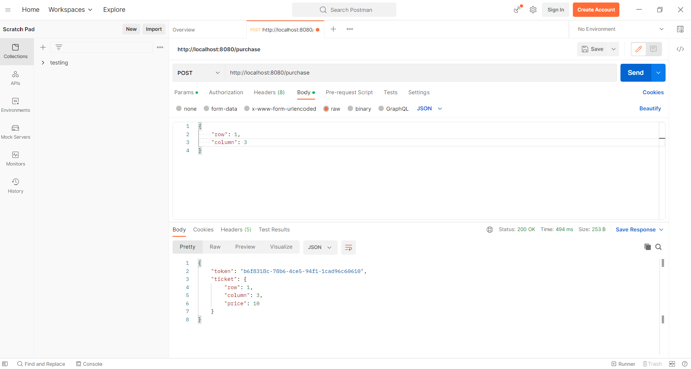
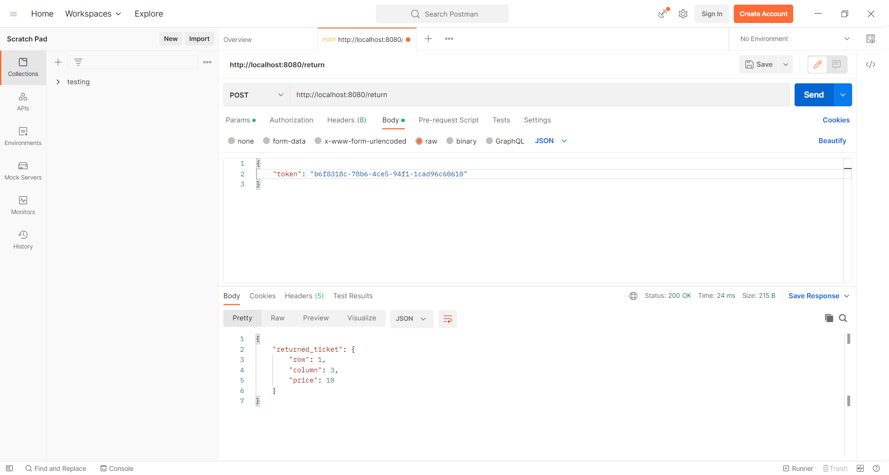
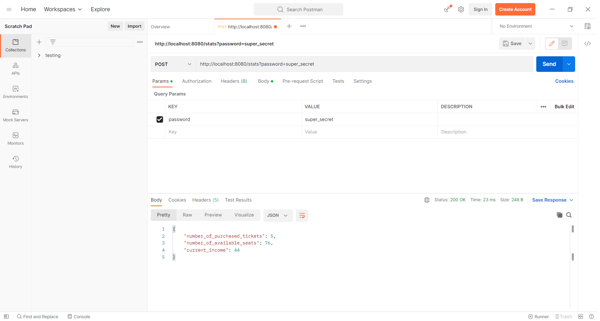

# Cinema-Room-REST-Service

Initialized at https://start.spring.io/ with the options of Maven & Java 17 selected and Spring Web added as a dependency.

Simulates a cinema room with 9 rows of 9 seats each.

Tokens are generated everytime a seat is purchased. 

Refunds are available through the same token.

Statistics can be viewed with a certain password shown in the last image.

Open project in IntelliJ and use Postman to make GET and POST requests

